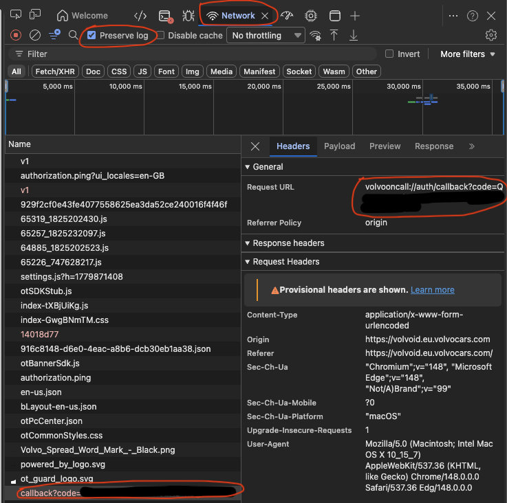

# Volvo AU — Home Assistant integration

Native Home Assistant custom component for AU-market Volvo BEVs (XC40 Recharge, etc.) using Volvo's iOS mobile gateway.

This integration talks directly to the same backend the Volvo Cars iOS app uses (`cepmobtoken.kr.prod.c3.volvocars.com`), so it works in regions where Volvo's public API isn't available — including Australia.

## Status

Personal project. Use at your own risk. Reverse-engineered from the iOS app; Volvo can change the API at any time.

## Features

### Read

- Battery: SoC %, range, charging power/current/voltage, charging state
- Odometer
- Doors, windows, hood, tailgate, central lock
- Tyre pressures (per wheel)
- Service health: brake fluid, engine coolant, oil, washer fluid, 12V, light warnings
- Service due (distance / days / engine hours)
- Charge schedule and target SoC
- Charge current limit (6–32 A)
- Last parked location + reverse-geocoded address (snaps to HA zones)
- Exterior temperature (via Volvo's weather service)
- Usage mode (in-use / abandoned)
- Software version (OTA)

### Write

- Lock / unlock (whole car)
- Unlock tailgate only (separate lock entity)
- Flash lights
- Honk + flash
- Refresh
- Climatization start / stop
- Air purification start / stop
- Charge schedule: enable/disable, start time, end time
- Charge current limit

### Adaptive polling

- **5 min** when idle
- **1 min** when active (charging, doors open, climate on, car in use)
- **5 sec for 5 min** after a trip ends (until you lock the car)
- **5 sec for 60 sec** burst after any command

None of this polling wakes the car — Volvo's cloud reads cached telemetry the car pushes opportunistically.

## Install

### Via HACS (recommended)

Click the badge above to add this repo to HACS in one click, then download "Volvo AU" and restart Home Assistant.

Manual steps if the badge doesn't work:

1. In HACS → Integrations → ⋮ menu → **Custom repositories**.
2. Add `https://github.com/seiken27/ha-volvo-au` with category **Integration**.
3. Find "Volvo AU" in the HACS integrations list, click **Download**.
4. Restart Home Assistant.
5. Settings → Devices & Services → Add Integration → "Volvo AU".  
   (Or click the "Add to Home Assistant" badge at the top of this README.)

### Manual

1. Copy `custom_components/volvo_au/` into your Home Assistant `config/custom_components/`.
2. Restart Home Assistant.
3. Settings → Devices & Services → Add Integration → "Volvo AU".

## Auth flow

Uses Volvo ID OAuth with PKCE + DPoP, same as the iOS app. You'll need:

- A Volvo Cars account paired with the vehicle in the official iOS app first
- Strongly recommended: a **secondary Volvo account** added as a "key user", paired via QR from the primary owner's app, used **only** by this integration — so the integration's token refresh activity doesn't disturb your primary phone's session

### Capturing the `volvooncall://` callback URL

During config-flow, you'll be sent to Volvo ID in a browser to sign in (+ 2FA). After login, Volvo tries to redirect to a `volvooncall://oauth/code?code=...&state=...` URL that the iOS app would normally handle. On a desktop browser there's no app to catch it, so you need to grab the URL manually and paste it back into Home Assistant.

**Recommended: use Chrome or Edge with DevTools.** Safari silently swallows custom-scheme redirects and won't show the URL anywhere.

1. Open **Chrome** or **Edge**.
2. Open **DevTools** (F12 or ⌥⌘I on Mac) → **Network** tab.
3. Tick **"Preserve log"** so the redirect entry doesn't get wiped.
4. Paste the Volvo ID login URL from Home Assistant into the address bar and sign in (complete 2FA).
5. After login, the page will go blank or show an error — that's expected. In the Network tab, scroll to the **last entry**: it'll be a request to `volvooncall://oauth/code?...` (usually shown in red as `(failed)`).
6. Right-click it → **Copy → Copy URL** (or **Copy link address**).
7. Paste that full URL back into the Home Assistant config-flow field.

*The bits you care about: **Network** tab open, **Preserve log** ticked, then the failed `callback?code=...` entry at the bottom — Request URL on the right is what you copy.*

The `state` parameter in the URL must match the one Home Assistant generated for the current flow attempt. If you cancel and restart the flow, request a fresh login URL — don't reuse an old one.

## ☕ Support

If this saved you some time (or you just like that the integration exists) and you’d like to support me, feel free to lob a coffee my way.

## License

MIT — see [LICENSE](./LICENSE).

## Disclaimer

Not affiliated with Volvo Cars. Using this integration may violate the Volvo Cars terms of service in some regions. Use a secondary account.
